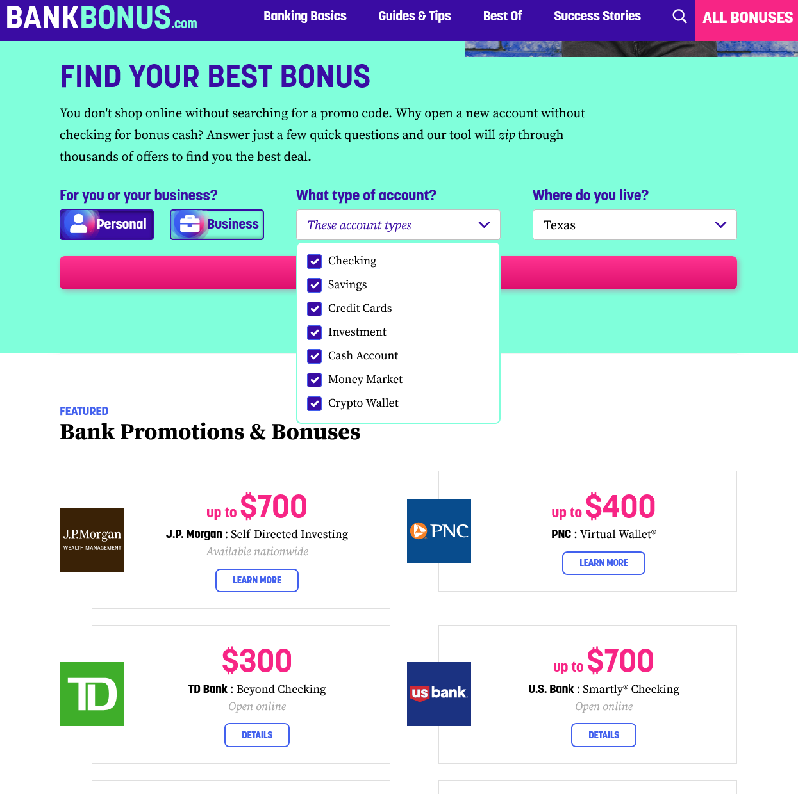
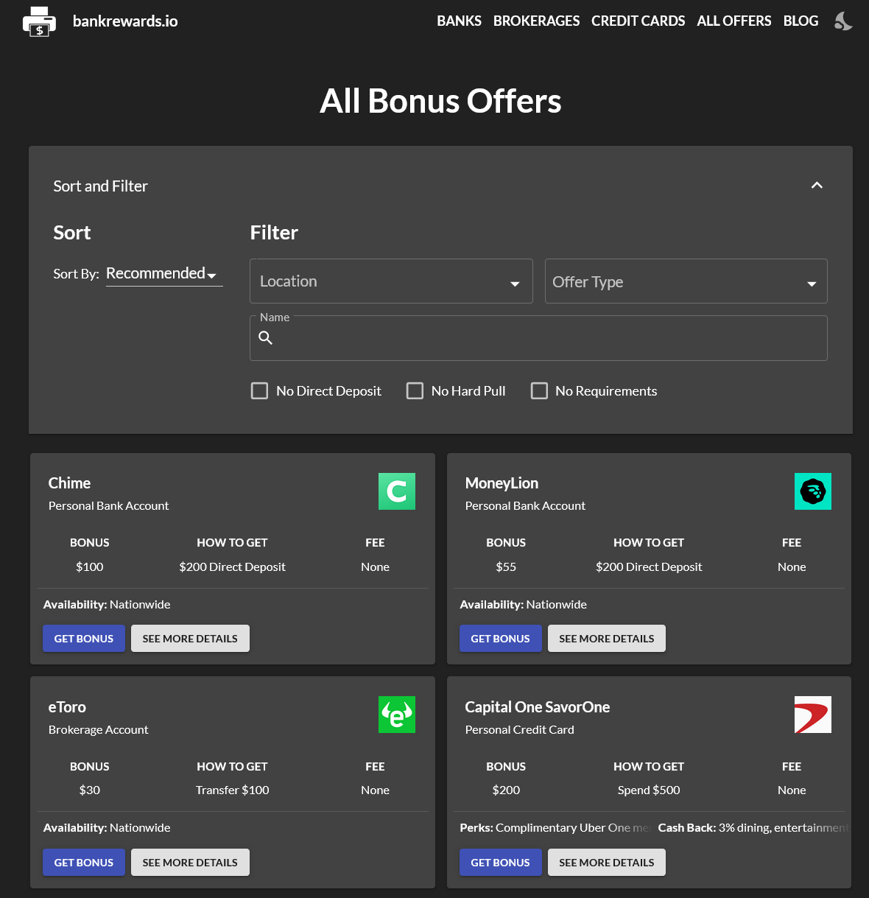

# Development

## Overview

I created a basic web app that displays a list of bank account opening bonuses and allows users to filter and save them. This app is intended to help people learn about opportunities to earn a bit of money on the side just for opening various bank accounts.

I focused this project on implementing interactive functionality, like sorting/filtering the list, as opposed to aesthetics or fancy designs. The final web app is [deployed here](https://bank-bonus-tracker.vercel.app/).

## Research

### Favoriting functionality

Before creating the web app, I conducted a competitive analysis of several existing sites with respect to their favoriting functionality. I compared [GitHub](https://github.com)'s repositiory starring functionality, [coolors.co](https://coolors.co/) ability to save colors and palettes, and [Spotify](https://spotify.com/) liked songs / playlists.Based on this analysis, I determined that I should include searching, filtering, and sorting functionality into my site as a baseline. I also realized that I should focus on making these interactive features easily-discoverable.

### Other Bank Bonus Sites

I looked at a variety of other sites that would be "competitors" to my app. I found that the best ones also had filtering / searching functionality - others that consisted of static long lists were difficult to traverse. Interestingly, I could not find any bank bonus site that allowed users to save particular offers - this presents a real opportunity for my app to distinguish itself in providing novel functionality.

<em>The only other bank bonus sites that had some level of filtering interactivity - all other were just static lists</em>

## The Process

The first step was determining the shape of the data for each bank bonus offer. This decision goes hand-in-hand with deciding what sort of interactivity I wanted my app to have - I'd only be able to sort/filter on fields that I explicitly included.

Next came the actual implementation process. First I created a static version of the app, focusing on getting a basic layout, design, and dividing different sections into components. Then I went ahead with implementing the interactivity. Overall, it wasn't too difficult considering the limited scoped of my app.

*The finished web app*

The interface was made with components from [Material UI](https://mui.com/material-ui/). Other parts of the tech stack include pnpm, Vite, and React.

### Further work

If I were to continue developing this app, I would develop a more purposeful theme, especially changing the color scheme to be more interesting. I also would add more advanced functionality that allows users to track their progress towards receiving each bonus offer. Tracked milestones would include applying for the account, opening it, fulfilling the requirements, receiving the bonus, and closing the account. Of course, I'd also have build out the backend with some sort of authentication and persistence to make the app remotely useful.

With this more complete feature set, I could see the app being very helpful. It fulfills a niche that isn't fully fulfilled elsewhere as far as I've determined'. While other sites that curate bank bonus offers do exist, none of them allow users to keep track of which offers they've already seen/received.
