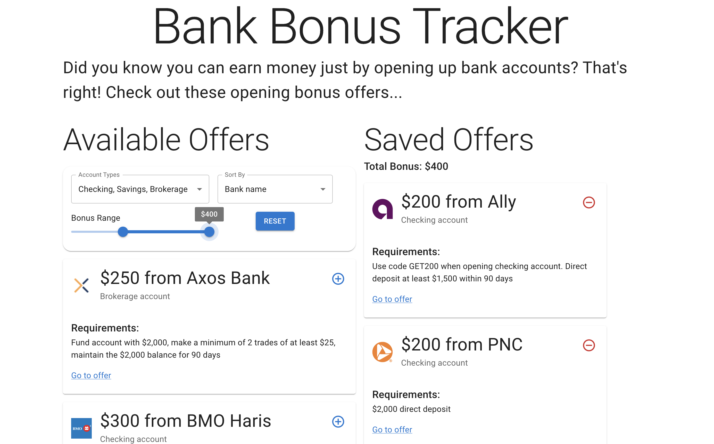

# Development

I created a basic web app that displays a list of bank account opening bonuses and allows users to save them. I focused this project on interactive functionality, like sorting/filtering the list, as opposed to aesthetics. The web app is [deployed here](https://bank-bonus-tracker.vercel.app/).

## Competitive Analysis of Favoriting Functionality

Before creating the web app, I conducted a competitive analysis of several existing sites in relation to their favoriting functionality. I compared [GitHub](https://github.com)'s repositiory starring functionality, [coolors.co](https://coolors.co/) ability to save colors and palettes, and [Spotify](https://spotify.com/) liked songs / playlists. All these sites require creating an account to use and persist their favoriting functionality.

### Comparison Table

| Factors | GitHub | Coolors | Spotify |
| ------- | ------ | ------- | ------- |
| Save without account | ❌ | ❌ | ❌ |
| Save to different custom-named lists | ✅ | ❌ | ✅ (playlists) |
| Save different categories of things to preset lists | ❌ | ✅ (colors, palettes, etc.) | ✅ (songs and podcasts) |
| Other people can see your favorites | ✅ | ❌ | ✅ (only playlists) |
| Can control visibility of favorites list | ❌ | ❌ | ✅ (only playlists) |
| Can search / filter favorites list | ✅ | ✅ | ✅ |
| Can sort favorites list by pre-defined attributes | ✅ | ❌ | ✅ |
| Can re-arrange list items with fully custom order | ❌ | ❌ | ✅ (only playlists) |
| Different ways of viewing list | ❌ | ❌ | ✅ (compact vs list view) |

### Summary

The main factors that distinguished these sites were related to the visibility of the favorites list to other users and whether you can save the favorites to multiple, potentially customizable lists. While it is difficult to say for certain which sites are most successful in providing favoriting functionality without user statistics, it seems likely that sites that provide more customizability like Spotify *seem* more successful. Additionally, I'd say that the sites that made different aspects of functionality related to favoriting easy to discover were more successful - for example, I previously was unaware that GitHub had the ability to categorize your starred repositories into custom lists.

### Ideas for implementation

Based on this analysis, I will try to incorporate searching, filtering, and sorting into my site's aggregate functionality - this will give users enough control to find content they want to interact with. Additionally, I will keep the aggregated lists private to each user - while for certain types of content it might make sense to be able to share your list with your friends, for the financial information my app handles, it is probably best to keep the saved list private.

## Implementation

The purpose behind my web app, as mentioned previously, is to allow users to learn about account opening bonuses that banks provide. They are able to filter the bonus offers by the type of account (checking savings, brokerage) and the value of the bonus. Additionally, they can sort the list of bonus offers by the bank's name or the value of the bonus.

My site also has an aggregation feature that is somewhat similar to the favoriting functionality explored in the previous section. It is fairly simple - users can save any offer they find interesting and see the total summed value of all their saved offers.

*The finished web app*

The interface was made with components from [Material UI](https://mui.com/material-ui/). Other parts of the tech stack include pnpm, Vite, and React.

### Further work

If I were to continue developing this app, I would develop a more purposeful theme, especially changing the color scheme to be more interesting. I also would add functionality that allows users to "track" their progress towards receiving each bonus offer. Tracked milestones would include applying for the account, opening it, fulfilling the requirements, receiving the bonus, and closing the account. Of course, I'd also have to add some sort of authentication and persistence to make the app remotely useful.

With this more complete feature set, I could actually see the app being very useful. It fulfills a niche that isn't fully fulfilled elsewhere as far as I know. While other sites that curate bank bonus offers do exist, none of them allow users to keep track of which offers they've already seen/received.
