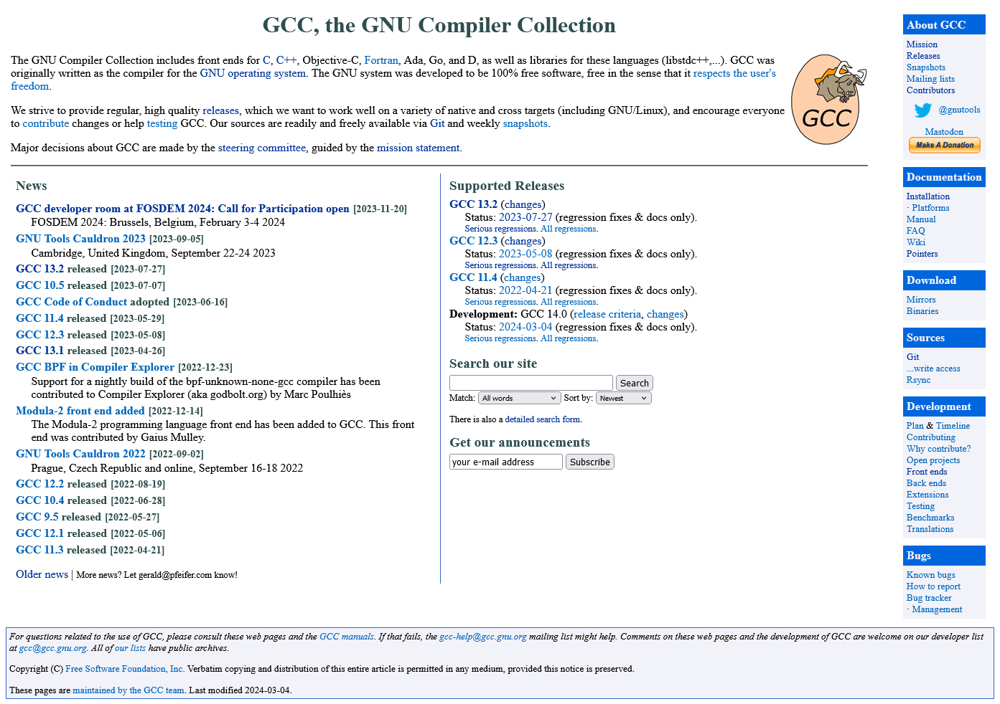

# Responsive Redesign

## Overview

GCC (GNU Compiler Collection) is a collection of compilers and development tools for a variety of lower-level programming langues like C. I sought to redesign the [home page for this project](https://gcc.gnu.org/) to make it more readable, responsive, and accessible. The presentation and documentation for programmer-tooling is often an after-thought, especially for older tooling like GCC. So I wanted to give some much-needed attention to this area. The [final redesigned site is accessible here](https://mitchman215.github.io/GCC-Redesign/).

## The existing site

*The original page*

### Issues

- Not responsive to different screen sizes
- Cluttered page - too much information all at once
- Hard to find important interactive elements
- Minimal visual hierarchy
- Accessibility problems with screen readers
- Navigation menu not in standard location

## The Process

I went through the full design process, from sketches to low-fidelity wireframes to high-fidelity mockups.

*Rough final sketch to be used in low-fi wireframes*

↓

*Annotated Low-Fi desktop wireframe*

↓

*High Fidelity Mockup*

↓

*Final redesigned site*

## Final Product

Besides the visual improvements to the site's layout, I focused on making the site responsive to different screen sizes ([try playing around with the site's screen size here!](https://mitchman215.github.io/GCC-Redesign)). I also tested the website with a screen-reader and ran it through some accessibility tests to ensure the site would be accessible to the widest variety of users.

## Lessons learned

1) **Prototyping and iteration** - it's much easier to adjust sketches/wireframes than an actual site.
2) **How to make a site responsive** - many factors involved, from designing specifically for mobile to choosing the correct units in CSS.
3) **Accssibility considerations** - impacts everything from color selection to choosing semantic html elements to aid screenreaders
