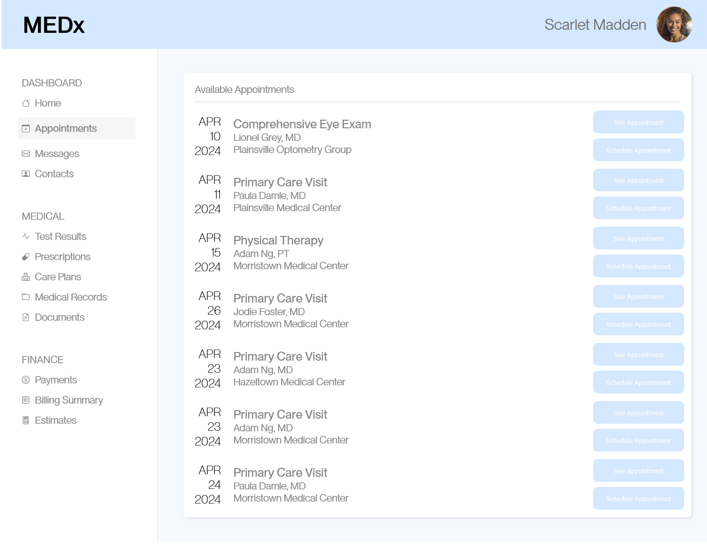
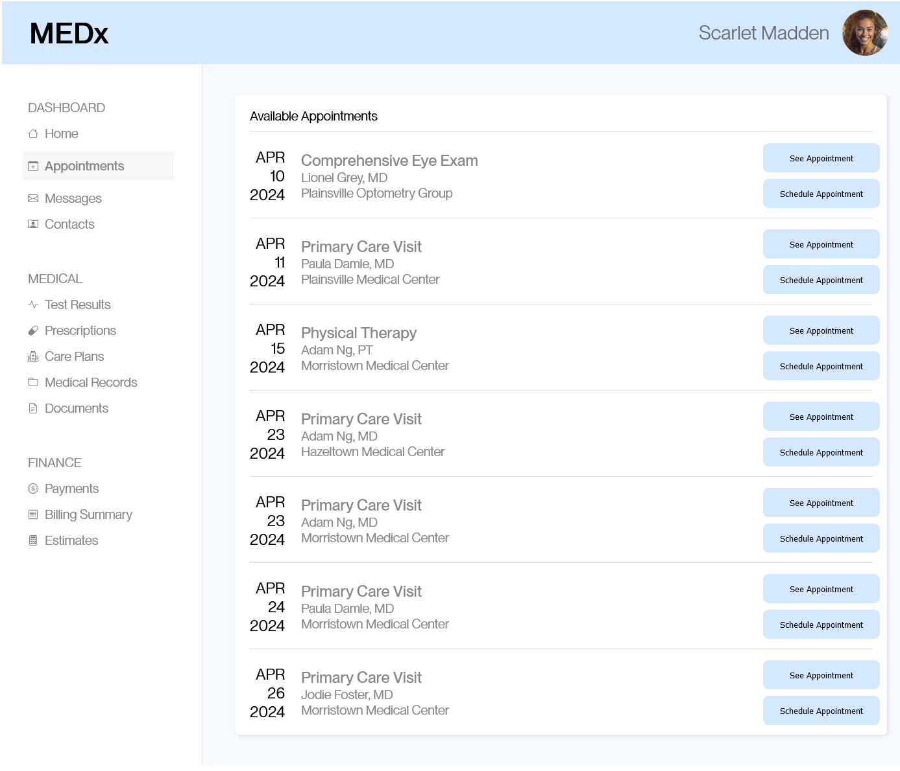
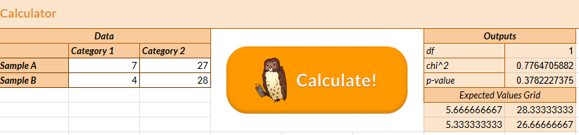
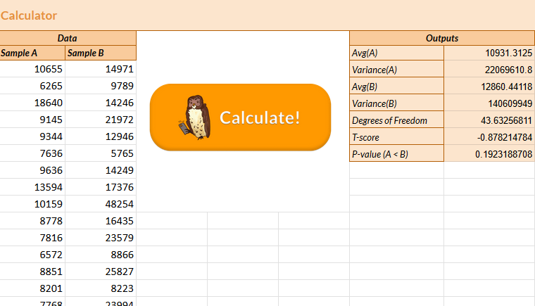
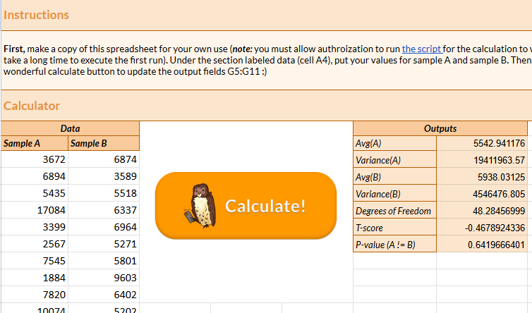

# AB Testing

## Summary

I made a small change to a sample page that helps patients book appointments with their doctors. Then, I gathered statistics on how long it took users to book an appointment with a specific doctor with the original version of the page (Version A) and my modified version (Version B).

## Change and Data Collection

*Version A - the original page*

*Version B - the modified page*

The task given to users was to "schedule an appointment with Adam Ng, MD at Morristown Medical Center on April 23, 2024". This experiment was conducted as a classroom study, which threatens the integrity of the results (see [Reflection](#reflection)). However, just as an exercise, I will create all hypothesis, predictions, and conduct all tests as if this data was from a robust source.

The raw data is available [here](#) for version A and [here](#) for version B. Overall, the task for Version A was conducted with 36 particpants, while Version B was conducted with 34 participants. Such a small sample sizes will make it more difficult to prove statistical significance, but again I will assume a larger pool of data was collected for the purposes of my predictions.

## Analysis

Next, I conducted statistical analysis on a variety of metrics.

### Misclick rates

**Null Hypothesis**: There is no difference in the misclick rate of Version A and Version B.

**Alternative Hypothesis**: Version B has a lower misclick rate than Version A.

The reasoning behind this alternative hypothesis is that version B has horizontal dividers between the different bookings and darker text, which would increase readability and allow users to more easily identify where to click.

**Prediction**: I predict that I will be able to reject the null hypothesis due to the reasons stated above for the alternative hypothesis. I believe that the increased readability will be significant enough to make a statistical difference in the number of misclicks.

**Test**: Chi-squared Test. I chose this test because we are measuring the difference between the counts behind a boolean (AKA a categorical variable) - either a participant did misclick, or they did not misclick.

#### Results

The difference in misclick rate between the two versions is **not** statistically significant - we fail to reject the null hypothesis. This is because the test had a p-value of 0.378, which is not below the 0.05 threshold required for significance. In other words, there is a 37.8% chance the differences we observed in the misclick rate between Version A and B are due to chance. Therefore, my prediction was wrong. Also relevant is that our test had 1 degree of freedom and had a chi-squared statistic of 0.776.

### Time on page

**Null Hypothesis**: There is no difference in the amount of time spent on the page between Version A and Version B before completing the task.

**Alternative Hypothesis**: Less time was spent on Version B than Version A before the task was acomplished.

The reasoning behind this alternative hypothesis is that the darker text is more readable, so participants will need to spend less time trying to discren the text and be able to accomplish their task more quickly.

**Prediction**: I predict that I will be able to reject the null hypothesis due to the reasons stated above for the alternative hypothesis. Assuming the data was collected in a robust and randomized way, it makes sense that people first seeing the page will be able to act quicker if they can read the text faster.

**Test**: One-tailed T-test. I chose this test because we are comparing a continuous (numeric) variable (hence the T-test), and we are trying to determine whether one variable is less than another variable (hence the one-tailedness).

#### Results

Note: due to the way the calculator is set up, Sample A corersponds to Version B and Sample B corresponds to Version A. This was necessary to match my alternative hypothesis

The time spent on the page is **not** statistically different between Version A and Version B - we fail to reject the null hypothesis. This is evident as we have a p-value of 0.192, which is above the 0.05 threshold for establishing significance. In other words, there is roughly a 19.2% chance that the difference we do observe between Versions A and B are simply due to chance. Also relevant to the calculation of the p-value was the T-score of -0.878 and 43.6 degrees of freedom.

**Summary Statistics** The mean time on page for Version A was 12.86 seconds compared to 10.9 seconds for Version B. Additionaly, we observed a variance of 140.6 seconds squared for Version A and 22.07 seconds squared for Version B. So while we know the difference is not statistically significant between the two versions, we do know that Version B had a lower and more consistent average time on page compared to Version A.

### Time before first click

**Null Hypothesis**: There is no difference in the amount of time before the user's first click between Version A and Version B.

**Alternative Hypothesis**: There was a difference in the amount of time before the user's first click between version A and version B.

The reasoning behind this alternative hypothesis would be that the increased readability afforded by the changes made in Version B would translate to users spending less time finding the correct appointment and thus earlier confidence to take an action.

**Prediction**: I predict that I will be able to reject the null hypothesis due to the reasons stated above for the alternative hypothesis. Assuming the data was collected in a robust and randomized way, it makes sense that changing the font weight and visual division between the appointments has *some* effect on how much time it takes a user to interact with the page.

**Test**: Two-tailed T-test. I chose this test because we are comparing a continuous (numeric) variable (hence the T-test), and we are trying to determine whether one variable is different than another variable (hence the two-tailedness).

#### Results

The time before first click is **not** statistically different between Version A and Version B - we fail to reject the null hypothesis. This is evident as we have a p-value of 0.642, which is above the 0.05 threshold for establishing significance. In other words, there is roughly a 64.2% chance that the difference we do observe between Versions A and B are simply due to chance. Also relevant to the calculation of the p-value was the T-score of -0.468 and 48.6 degrees of freedom.

**Summary Statistics** The mean time before first click for Version A was 5.54 seconds compared to 5.94 seconds for Version B. Additionaly, we observed a variance of 19.41 seconds squared for Version A and 4.546 seconds squared for Version B. Since we weren't able to establish statistical significance, we aren't able to conclude much from these statistics - nonetheless, it is interesting that Version B had a much lower variance than Version A.

## Conclusion

For all 3 different metrics, we were not able to find a statistically significant difference between the two versions of the webpage. Therefore, we are not confident that Version B is better (or worse) than Version A.

Note that the results of these statistical tests could just be a consequence of not having enough data, as our sample size of n=34 and n=36 is very small. So if this experiment were to be repeated, we ideally would have a larger pool of data.

### Reflection

This project was mostly just an exercise to practice conducting statistical tests. The actual circumstances under which the data was gathered is flawed for several reasons. The users that these tests were conducted upon were other Brown University students who were also completing this assignment. Furthermore, these student users repeatedly completed the exact same task on slightly different versions of the same original page in very short-succession. So they were very familiar with the page and had (usually correct) expectations about where to click before even starting the experiment. The fact that the test population also was the population responsible for organizing the tests has the potential to create conflicting interests (for example, one student might purposefully do poorly on version A so that they would be more likely to conclude that their version B was better).

That is to say, I would not actually trust the results of any of these tests. However, if these tests were conducted in the real world, then I anticipate that the methodology would be a lot more robust (especially regarding how the data was gathered).
