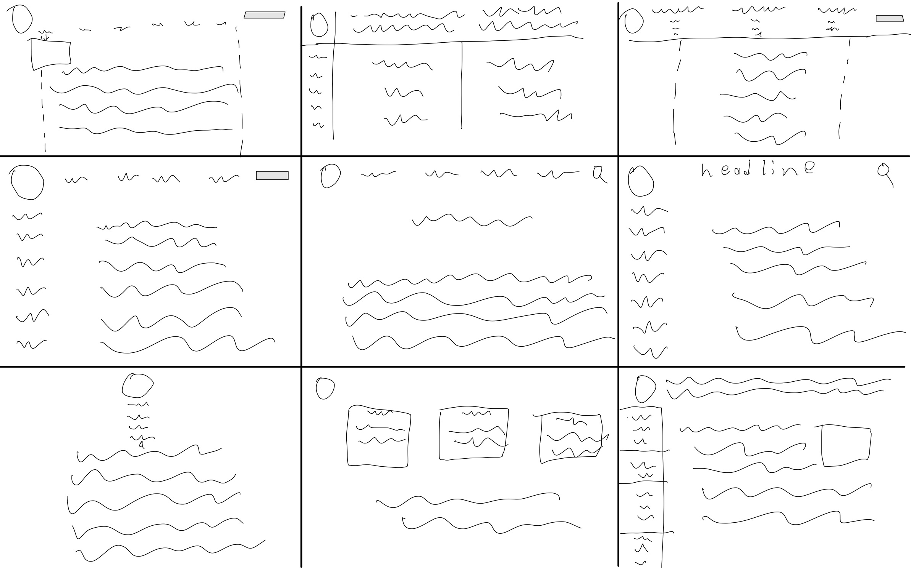
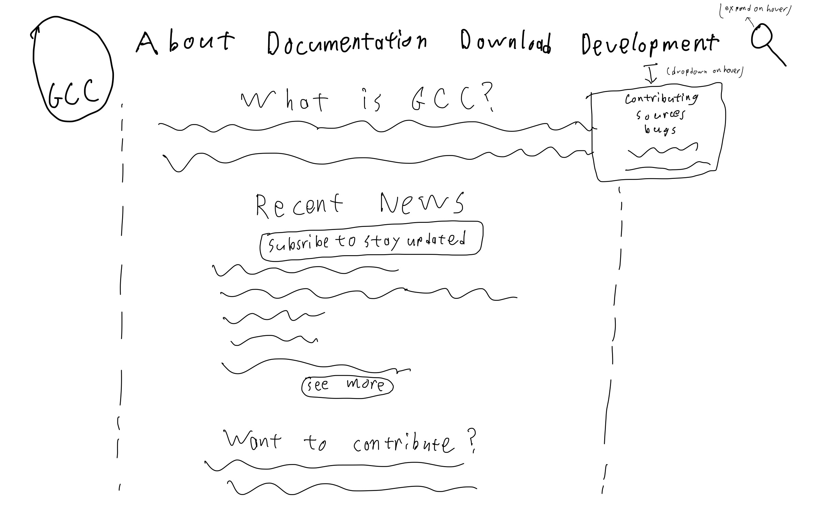
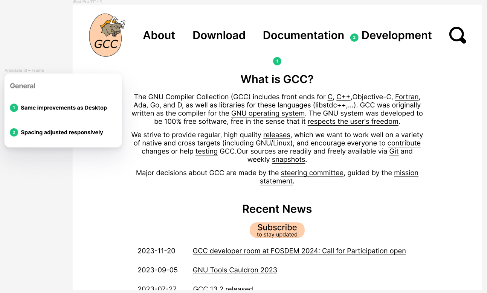
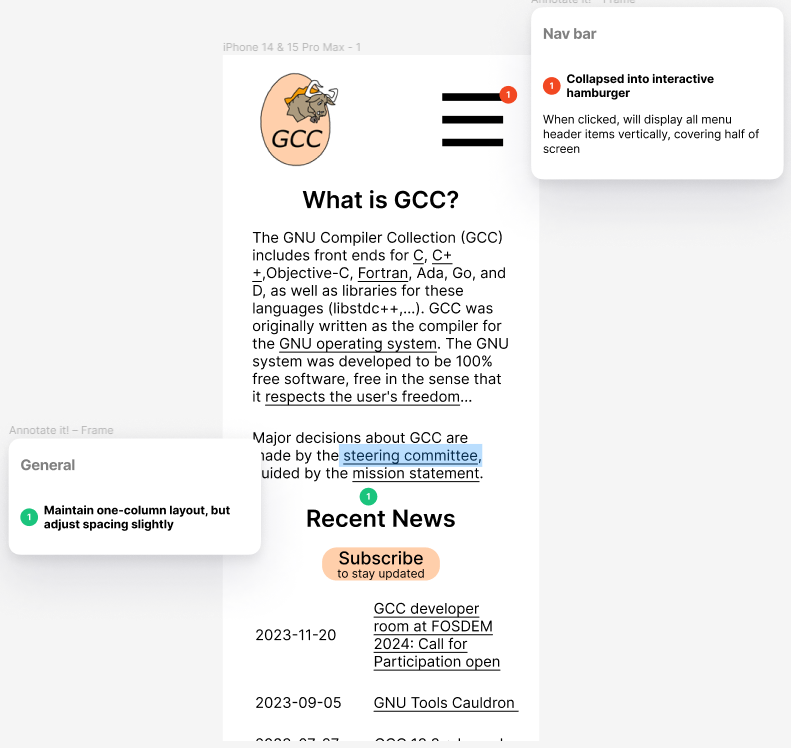

# Responsive Redesign

## Summary

I sought to redesign the home page for the [GCC (GNU Compiler Collection) project](https://gcc.gnu.org/) to make it more responsive and accessible. I chose this site because I think, more often than not, the presentation of documentation for software engineering tools is neglected and has room for improvement. While this site wasn't the worse instance I've ever seen of this, I still thought there was enough to improve (especially from an accessibility point of view).

## Existing site

*The original page*

### Problems

#### General

- Not responsive to different screen sizes - same exact layout on desktop and mobile makes readability difficult (especially on mobile or slim desktop window)
- Hard to find important interactive elements like search bar and field to sign up for announcements
- Cluttered page - too much information all at once, text size is pretty small
- Very minimal visual hierarchy

#### Navigation menu

- Non-standard location
- Is at the end of HTML as opposed to the beginning (not convenient for screen readers)
- Cluttered with sub-items

#### News section

- Sometimes items has additional description, sometimes not.
- Dates not in consistent layout due to varying title lengths

### Accessibility Report

I ran [WebAIM WAVE](https://wave.webaim.org/) on the website and found several problems. The two text input fields (searchbar and email address subscription) were missing form labels for example, and the entire page layout used HTML tables. Both of these issues (along with a few more minor ones like missing semantic HTML page regions) can lead to problems with screen-readers.
Overall, I agree with all the issues raised by this tool and intend to fix them.

## Prototyping

### Sketches

First I started by brainstorming new layouts in sketches.

*Initial sketches drawn as a brainstorming exercise*

*Rough final sketch to be used in low-fi wireframes*

### Low-Fidelity Wireframes

Next I designed low-fidelity wireframes that would demonstrate the desired layout of the page with 3 different screen sizes. I also annotated these wireframes to show how they addressed [the problems with the original webpage that I noted earlier](#problems).

*Low-Fi desktop wireframe*

*Low-Fi tablet wireframe*

*Low-Fi mobile wireframe*

### High-Fidelity Mockup

#### Tablet

#### Mobile

### Style Guide

## Final Product

The full website can be found here.

### Reflection
