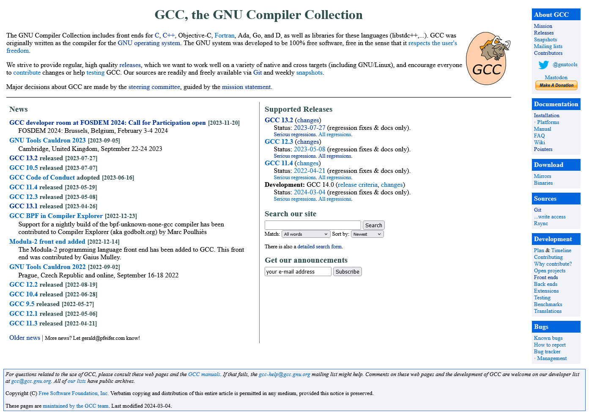
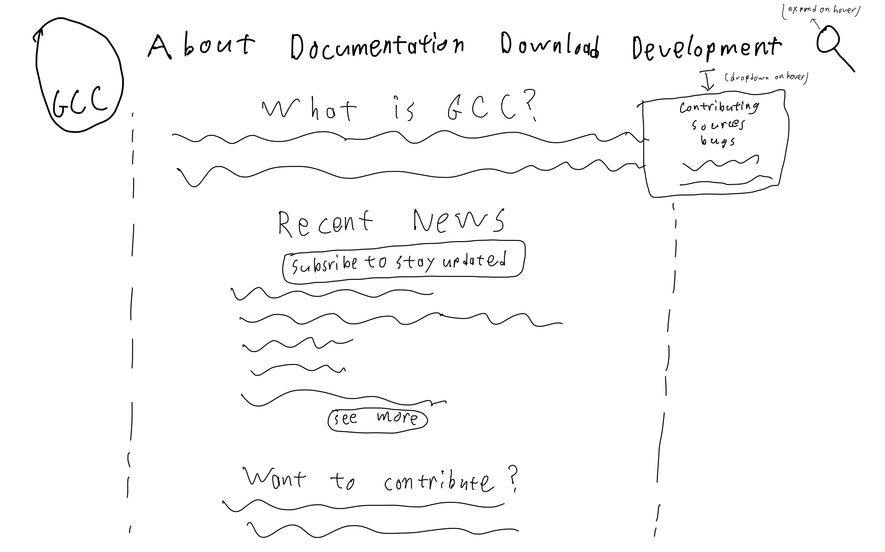
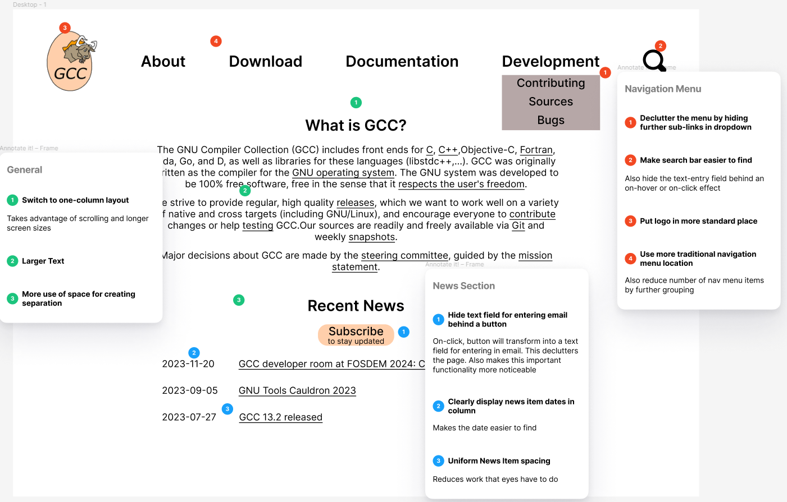
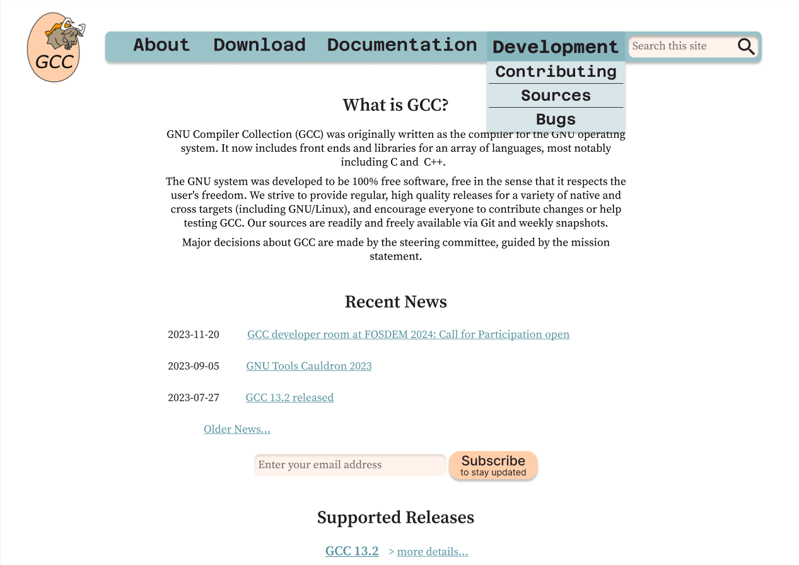

# Responsive Redesign

## Overview

GCC (GNU Compiler Collection) is a collection of compilers and development tools for a variety of lower-level programming langues like C. I sought to redesign the [home page for this project](https://gcc.gnu.org/) to make it more readable, responsive, and accessible. The presentation and documentation for programmer-tooling is often an after-thought, especially for older tooling like GCC. So I wanted to give some much-needed attention to this area.

## Issues with the existing site

*The original page*

- Not responsive to different screen sizes
- Cluttered page - too much information all at once
- Hard to find important interactive elements
- Minimal visual hierarchy
- Accessibility problems with screen readers
- Navigation menu not in standard location

## The Process

### Sketches

First I started by brainstorming new layouts in sketches.

*Rough final sketch to be used in low-fi wireframes*

### Low-Fidelity Wireframes

Next I designed and annotated low-fidelity wireframes, showing how my design choices addressed the issues with the original page.

*Low-Fi desktop wireframe*

### High-Fidelity Mockup

The final mockup added color and typography to the design.

## Final Product

The full website can be found [here](https://mitchman215.github.io/GCC-Redesign). Besides the visual improvements to the site's layout, I focused on making the site responsive to different screen sizes (TODO: include visuals).

Also tested the website with a screen-reader to ensure the site would be accessible to the widest variety of users.

## Lessons learned

1) **Prototyping and iteration** - it's much easier to adjust sketches/wireframes than an actual site.
2) **Responsivity and Accessibility considerations** - Many factors involved, from designing specifically for mobile to choosing the correct units in CSS.
